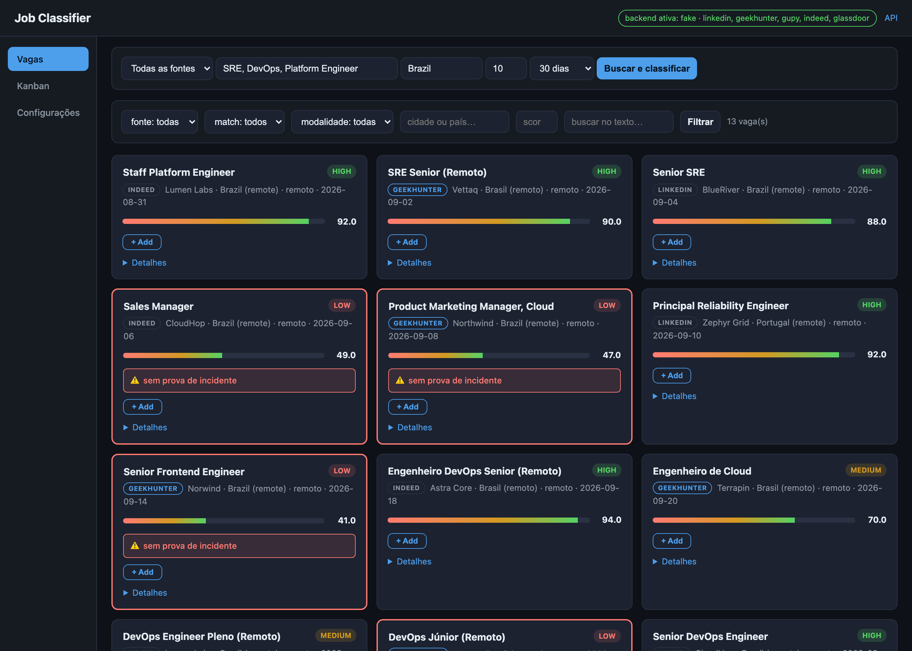
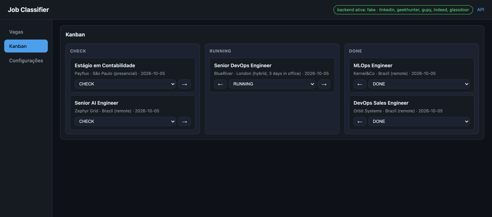
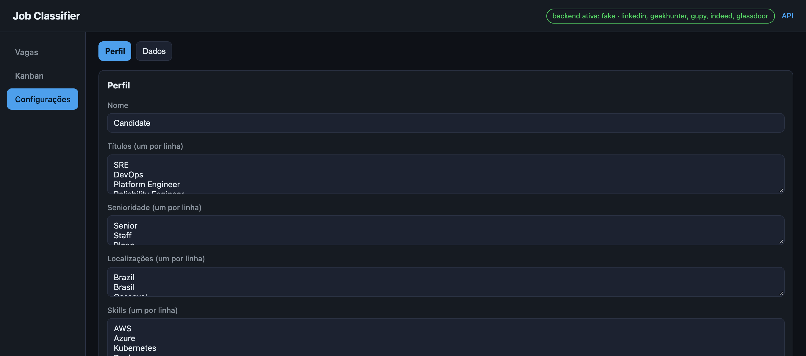

# Job Classifier

**MVP local para buscar vagas em cinco fontes, classificá-las contra um perfil profissional com o modelo Laya (ou fallback heurístico) e servi-las por API + dashboard.**

[](https://github.com/adilsonmenechini/jobs-laya/actions/workflows/ci.yml)
[](https://www.python.org/)
[](https://docs.astral.sh/ruff/)

[Visão geral](#visão-geral) •
[Stack](#stack) •
[Instalação](#instalação) •
[Dashboard](#dashboard) •
[Como funciona](#como-funciona) •
[Configuração](#configuração) •
[Fontes](#fontes) •
[API](#api) •
[Testes, linter e CI](#testes-linter-e-ci) •
[Estrutura](#estrutura-do-projeto) •
[Limitações](#limitações-do-mvp) •
[Changelog](CHANGELOG.md)

---

## Visão geral

O pipeline faz seis coisas:

1. buscar vagas no **LinkedIn** e no **Glassdoor** (browser local, Patchright), no
   **GeekHunter** e na **Gupy** (HTTP público, sem login) e no **Indeed** (API
   GraphQL pública);
2. obter detalhes;
3. normalizar e deduplicar;
4. classificar contra um perfil profissional;
5. salvar em SQLite;
6. listar e filtrar pela API e pelo dashboard.

A arquitetura usa **Laya de verdade** (o modelo de decisões tipadas da ConvAI,
`laya[serve]`): o classifier combina as respostas `choice`, `score` e `noul`
do modelo com sinais determinísticos (skills, senioridade, remoto) numa
política local — probabilidades calibradas em vez de geração livre.

### O que tem

| Feature | Descrição |
| --- | --- |
| **5 fontes + `all`** | LinkedIn e Glassdoor via browser local (Patchright); GeekHunter, Gupy e Indeed via HTTP público, sem login |
| **Kanban de candidaturas** | Colunas `CHECK` / `RUNNING` / `DONE`, persistidas em `kanban_jobs`, com snapshot próprio — o card sobrevive ao clean |
| **Classifier Laya** | 5 perguntas tipadas num único forward pass + sinais heurísticos, com fallback automático para heurística |
| **Currículo em Markdown** | Contexto opcional em `data/curriculum.md`, editável pelo dashboard; versionado por hash e citado em `reasons` — **não altera o score** |
| **Deduplicação** | Por `(source, source_id)` — re-sincronizar atualiza, nunca duplica |
| **API + dashboard** | FastAPI com filtros, `/health`, Swagger e frontend estático servido pela própria API |
| **Tools locais** | Catálogo read-only de vagas no estilo `linkedin-mcp-server`, 100% local, sem MCP |
| **Avaliação** | Ablação `heuristics only` / `laya only` / `combined` sobre 18 vagas rotuladas |
| **Segurança** | Somente leitura (nenhuma tool de escrita), credenciais só no navegador, `bandit` + `gitleaks` no pre-commit **e** no CI |

## Stack

- Python 3.13+
- FastAPI · SQLAlchemy · SQLite · Pydantic
- Laya (`laya[serve]`) + torch/transformers
- Patchright (Chromium local) · httpx · BeautifulSoup
- pytest · ruff

## Instalação

```bash
make install
```

ou manualmente:

```bash
uv sync --extra dev
uv run patchright install chromium
```

### Login do LinkedIn (uma vez)

O projeto usa um browser local próprio (Patchright). Rode:

```bash
make login
# equivalente a: uv run python -m app.linkedin.login
```

Uma janela do Chromium abre na página de login do LinkedIn. Faça login ali —
suas credenciais vão direto para o navegador, nunca passam por este código.
A sessão fica salva no perfil persistente `~/.linkedin-laya/profile/` e é
reusada por todas as chamadas seguintes. Repita o `make login` só se o cookie
`li_at` expirar.

## Dashboard

```bash
make run
# equivalente a: uv run uvicorn app.main:app --reload --port 3080
```

O menu lateral tem três entradas: **Vagas**, **Kanban** e **Configurações**.
Vagas é a tela inicial; Perfil e Dados moram como abas dentro de Configurações
(`#/configuracoes/perfil`, `#/configuracoes/dados`).

Swagger em <http://localhost:3080/docs>.

### Vagas

Busca (`fonte`, `termos`, `local`, `quantidade`, `janela de recência` +
**Buscar e classificar`), filtros (fonte, match, modalidade, cidade/país,
score, busca textual) e a lista de vagas classificadas com score, badge de
match e as ações **+ Add** (manda para o Kanban) e **Detalhes**.



### Kanban

Três colunas — `CHECK`, `RUNNING`, `DONE` — movíveis pelo select e pelas
setas de cada card. Um card sai da lista de Vagas ao ser adicionado, e a
vaga **não volta a aparecer** lá enquanto estiver no Kanban.



### Configurações

Aba **Perfil** para editar os dados usados pelo classifier (títulos, senioridade,
skills, foco, exclusões, remoto obrigatório) e o **currículo** em Markdown. Aba
**Dados** para ver o total de vagas por fonte e limpar as vagas coletadas — o
clean **preserva** tudo que está no Kanban.

O currículo é opcional e fica em `data/curriculum.md`, **fora do git** (tem
dados pessoais). O template está em `data/curriculum.example.md`.

> **O currículo não muda o score.** Ele é contexto: o classifier extrai as
> skills e a senioridade, compara com a vaga e escreve em `reasons`
> ("Currículo confirma: kubernetes, terraform") e em `curriculum_version`
> gravado na vaga. Fazer o Laya realmente usar esse contexto exige
> fine-tuning — ver `plan/sdd/spec-202610052324.md` para a medição que motivou
> a decisão.



> Os prints usam um banco isolado semeado com as amostras de `eval/samples/`
> e `CLASSIFIER_BACKEND=fake` — nenhum dado real do LinkedIn aparece neles.

## Como funciona

```
┌──────────────────────────────────────────────────────────────────────┐
│                     POST /jobs/sync                                  │
│  source: linkedin · geekhunter · gupy · indeed · glassdoor · all     │
└──────────────────────────────┬───────────────────────────────────────┘
                               │
  ┌──────────┬──────────┬──────┴─────┬──────────┬──────────┐
  │ LinkedIn │GeekHunter│    Gupy    │  Indeed  │ Glassdoor│
  │Patchright│ httpx    │   httpx    │  httpx   │Patchright│
  │ (browser)│ +JSON-LD │   +API     │ +GraphQL │ (browser)│
  │make login│ sem login│  sem login │ sem login│ sem login│
  └────┬─────┴────┬─────┴─────┬─────┴────┬─────┴────┬─────┘
       │          │           │          │          │
       └──────────┴─────┬─────┴──────────┴──────────┘
                        ▼
      normalizar → dedup por (source, source_id) → SQLite
                        │
                        ▼
      ┌─────────────────────────────────────────────┐
      │ Classifier (CLASSIFIER_BACKEND)             │
      │  laya: 4 perguntas tipadas · 1 forward pass │
      │        + sinais heurísticos                 │
      │        ↳ falha? fallback p/ heurística      │
      │  fake / heuristic: sem modelo               │
      └─────────────────────┬───────────────────────┘
                            ▼
      FastAPI: GET /jobs · /tools · /health · /profile · dashboard

      jobs (coletadas)  ──+ Add ──▶  kanban_jobs (CHECK/RUNNING/DONE)
      GET /jobs omite as cardadas   snapshot sobrevive ao clean
```

O modelo só carrega no primeiro uso, nunca no startup — `GET /health`
mostra `{backend, laya_ready, device}` e mantém boot e testes sem download.

## Configuração

### Perfil

O perfil padrão está em `data/profile.json`. Altere os títulos, senioridade,
skills e preferências de remoto pelo dashboard (Configurações → Perfil) ou
editando o arquivo.

#### Exclusões (dealbreakers)

O campo `exclusions` lista termos que **vetam a vaga** — se aparecerem no
título ou descrição, o `match` é forçado para `low` (score ≤ 49) e o motivo
fica em `gaps`/`reasons` e `decision.excluded`:

```json
"exclusions": ["inglês fluente", "inglês avançado", "fluent english"]
```

O matching é case-insensitive, ignora acentos e usa fronteira de palavra
(`"ingles"` não casa em `"inglesa"`). Vale nos três backends (`laya`, `fake`,
`heuristic`) — no `laya`, o veto é reaplicado depois do merge com o modelo.

### Backend do classifier

Escolhido por `CLASSIFIER_BACKEND`:

| Valor | O que é |
|---|---|
| `laya` (default) | Laya real via `laya[serve]` — 4 perguntas tipadas em 1 forward pass, combinadas com os sinais heurísticos. A **primeira classificação baixa o checkpoint (~800 MB)** do Hugging Face. |
| `fake` | Mesma política, mas com `FakeEngine` determinístico (keywords) — pipeline completo sem modelo. |
| `heuristic` | Só a heurística antiga (`LayaInspiredClassifier`), sem modelo. |

Device automático (`cuda` > `mps` > `cpu`); pode fixar com `LAYA_DEVICE`.
Se o engine falhar, a classificação **cai para a heurística automaticamente**
e o motivo fica registrado em `decision.laya.error` — nunca perde o veredito.

Perguntas do Laya (todas em um passe, em `app/classifier/questions.py`):

- `role_family` (choice): site_reliability / devops / platform_cloud / ai_ml / other
- `remote` (noul): é vaga remota?
- `seniority` (score): junior/mid → senior → staff/principal
- `skill_fit` (noul): casa com o perfil de infra/Kubernetes/Terraform/cloud?

### Variáveis de ambiente (`.env`)

O arquivo `.env.example` traz a lista completa; ver também `app/config.py`
(nome das settings em `UPPER_CASE`). As principais:

```text
DATABASE_URL=sqlite:///./data/jobs.db
PROFILE_PATH=data/profile.json
CLASSIFIER_BACKEND=laya
LAYA_DEVICE=

# LinkedIn (browser local)
LINKEDIN_PROFILE_DIR=~/.linkedin-laya/profile
LINKEDIN_HEADLESS=true
LINKEDIN_DELAY_SECONDS=1.0
LINKEDIN_NAV_TIMEOUT_MS=30000

# Fontes HTTP (sem login)
GEEKHUNTER_BASE_URL=https://www.geekhunter.com
GEEKHUNTER_DELAY_SECONDS=1.0
GEEKHUNTER_PAGE_SIZE=25
GEEKHUNTER_TIMEOUT_S=30.0
GEEKHUNTER_MAX_RETRIES=2
GEEKHUNTER_BACKOFF_SECONDS=5.0

GUPY_BASE_URL=https://portal.gupy.io
GUPY_DELAY_SECONDS=1.0
GUPY_PAGE_SIZE=10
GUPY_TIMEOUT_S=30.0
GUPY_MAX_RETRIES=2
GUPY_BACKOFF_SECONDS=5.0

# Indeed (API GraphQL pública; credencial e mercado vêm do .env)
INDEED_API_KEY=
INDEED_CO=BR
INDEED_LOCALE=pt-BR
INDEED_BASE_URL=https://apis.indeed.com
INDEED_DELAY_SECONDS=1.0
INDEED_PAGE_SIZE=25
INDEED_TIMEOUT_S=30.0
INDEED_MAX_RETRIES=2
INDEED_BACKOFF_SECONDS=5.0

# Glassdoor só via browser local: HTTP direto responde 403 (Cloudflare)
GLASSDOOR_BASE_URL=https://www.glassdoor.com
GLASSDOOR_DELAY_SECONDS=2.0
GLASSDOOR_TIMEOUT_MS=30000
GLASSDOOR_HEADLESS=false

# Sync: janela de recência e pausa de cortesia entre fontes
HOURS_OLD=720
SYNC_DELAY_SECONDS=1.0
```

## Fontes

O sync suporta `source: "linkedin" | "geekhunter" | "gupy" | "indeed" | "glassdoor" | "all"`
(default `all`):

| Fonte | Backend | Login | Notas |
|---|---|---|---|
| `linkedin` | browser local (Patchright) | `make login` uma vez | mesmo comportamento de sempre |
| `geekhunter` | HTTP público (`httpx`) + JSON-LD | não precisa | sem browser; delay configurável |
| `gupy` | HTTP público (`httpx`) + API JSON | não precisa | sem browser; pagina por `offset` |
| `indeed` | HTTP público (`httpx`) + API GraphQL | não precisa | sem browser; descrição e data já vêm na busca; pagina por `cursor` |
| `glassdoor` | browser local (Patchright) | não precisa | HTTP direto dá 403 (Cloudflare) |
| `all` | roda todas | — | falha de uma fonte não derruba as outras; o response traz `errors` por fonte |

Comportamento do sync (vale para qualquer fonte):

- **Recência:** publicações com `posted_at` mais antigo que a janela são
  descartadas antes de salvar. A janela vem do form do dashboard
  (**1 dia · 72 horas · 7 dias · 30 dias (default) · sem filtro**), enviada
  como `hours_old` no `POST /jobs/sync` (`0` = mantém tudo; o default do
  `.env` é `HOURS_OLD=720`). Sem data ou com data não parseável
  ("Publicada há 5 dias"), a vaga é **mantida** — nunca se descarta o que
  não se consegue datar.
- **Cortesia entre fontes:** o sync `all` espera `SYNC_DELAY_SECONDS`
  (default 1s, `0` desliga) entre uma fonte e a próxima, para não bater todas
  de uma vez do mesmo IP.
- **Ordem da lista:** o dashboard sempre ordena do **mais novo pro mais
  velho** (`created_at` desc), com o **score maior** quebrando o empate.

### Buscar e classificar

```bash
curl -X POST http://localhost:3080/jobs/sync \
  -H 'Content-Type: application/json' \
  -d '{
    "keywords": ["SRE", "DevOps", "Platform Engineer", "AI Engineer"],
    "location": "Brazil",
    "limit": 25,
    "fetch_details": true
  }'
```

A resposta informa quantas vagas foram coletadas e classificadas, mais um
mapa `errors` por fonte (vazio quando tudo funcionou):

```json
{"synced": 25, "errors": {}}
```

Deduplicação é por `(source, source_id)` — a mesma vaga re-sincronizada
atualiza, nunca duplica, e o mesmo `source_id` de fontes diferentes convive
no mesmo banco. Filtro na listagem: `GET /jobs?source=geekhunter`.

### Detalhes por fonte

- **GeekHunter** — JSON-LD das páginas públicas (`ItemList` na listagem,
  `JobPosting` no detalhe), com fallback para o DOM renderizado.
- **Gupy** — API pública `GET /api/job-search/jobs` (`jobName`, `limit`,
  `offset`). `location` é mapeado com cuidado: `remoto`/`remote` vira
  `workplaceType=remote` (nunca `city=remoto`), nome completo de estado vira
  `state=` (ex.: `Bahia`), qualquer outra coisa vira `city=`.
- **Indeed** — API GraphQL pública `POST /graphql` (a mesma que o JobSpy
  usa). Escolhida de propósito: a SERP em HTML **não traz descrição nem data
  de publicação**, e o classifier pontua as duas. `location` vira o clause
  `where:`; `posted_at` usa `dateOnIndeed` com fallback para `datePublished`.
  Falha de transporte é **repetida** com backoff exponencial + jitter.
- **Glassdoor** — SERP aberta via browser local e parseada pelos cards
  (`data-test="job-title"`, `compactEmployerName`, `emp-location`,
  `descSnippet`). `location` é **ignorado** (a busca cobre o Brasil inteiro).

Somente leitura: nenhuma tool de escrita em nenhuma fonte.

## API

### Listar

```bash
curl "http://localhost:3080/jobs?match=high&limit=20"
```

Outros filtros:

```text
GET /jobs?match=medium
GET /jobs?remote=true
GET /jobs?query=kubernetes
GET /jobs?min_score=70
GET /jobs?source=geekhunter
GET /jobs/{job_id}
GET /profile · PUT /profile
GET /curriculum · PUT /curriculum
GET /health
```

`GET /jobs` **omite** as vagas que já têm um card no Kanban — quem está em
processo de candidatura não aparece para análise de novo.

### Kanban de candidaturas

Vagas marcadas para candidatura moram em `kanban_jobs`, separadas das vagas
coletadas em `jobs`. A identidade da candidatura é `(source, source_id)` — **não**
`jobs.id`, que o SQLite recicla depois de um `DELETE`. Cada linha guarda um
snapshot (`title`, `company`, `location`, `url`, `remote`), então o card continua
correto mesmo depois de a vaga de origem ser removida de `jobs`.

```text
CHECK   → selecionada para análise/candidatura
RUNNING → candidatura em andamento
DONE    → candidatura concluída
```

```bash
# adicionar ao Kanban (idempotente: repetir devolve o mesmo card)
curl -X POST http://localhost:3080/kanban \
  -H 'Content-Type: application/json' \
  -d '{"source": "gupy", "source_id": "12345"}'

# listar tudo, ou filtrar por coluna
curl http://localhost:3080/kanban
curl "http://localhost:3080/kanban?status=RUNNING"

# mover um card
curl -X PATCH http://localhost:3080/kanban/7 \
  -H 'Content-Type: application/json' \
  -d '{"status": "RUNNING"}'

# devolver a vaga para o front principal
curl -X DELETE http://localhost:3080/kanban/7
```

`POST /kanban` responde `200` nos dois casos — card novo ou já existente. O
cabeçalho `X-Already-Existed: true|false` distingue os dois. `PATCH` grava
`applied_at` na primeira entrada em `DONE`. `status` fora do conjunto
`CHECK|RUNNING|DONE` devolve `422`; id inexistente devolve `404`.

### Limpar vagas coletadas

```bash
curl -X DELETE http://localhost:3080/jobs
# → {"deleted": 42, "kept": 7}
```

Apaga apenas as vagas **fora** do Kanban. `kept` conta os cards preservados.

## Tools locais (read-only)

A API expõe uma camada de *tools* locais modelada no catálogo do
[`stickerdaniel/linkedin-mcp-server`](https://github.com/stickerdaniel/linkedin-mcp-server),
mas com backend 100% local: browser Patchright controlado por este projeto,
**sem MCP e sem scraping separado**. Escopo atual: **somente leitura de vagas**
— nenhuma tool de escrita (mensagens, conexões, candidaturas). Navegações são
sequenciais, com delay configurável (`LINKEDIN_DELAY_SECONDS`) para reduzir
risco de bloqueio.

```bash
# descoberta (name, description, input_schema)
curl http://localhost:3080/tools

# search_jobs(keywords, location, limit)
curl -X POST http://localhost:3080/tools/search_jobs \
  -H 'Content-Type: application/json' \
  -d '{"keywords": "SRE", "location": "Brazil", "limit": 10}'

# get_job_details(job_id)
curl http://localhost:3080/tools/get_job_details/1234567890

# get_saved_jobs(limit)
curl "http://localhost:3080/tools/get_saved_jobs?limit=10"
```

Comportamento de erro: `422` entrada inválida, `404` vaga inexistente,
`502` falha do backend (browser/sessão LinkedIn indisponível).

Os tools são puros (não gravam no SQLite) — para persistir e classificar, use
`POST /jobs/sync`.

## Avaliação (eval)

```bash
make eval
# equivalente a: uv run python eval/evaluate.py
```

O eval roda os **três screeners** sobre as 18 vagas fictícias rotuladas à mão em
`eval/samples/` (12 EN, 6 PT; 7 high, 5 medium, 6 low) e escreve
`eval/evaluation.md` + `eval/results/{backend}.json`:

| Screener | O que é |
|---|---|
| Heuristics only | `LayaInspiredClassifier` puro (keywords e sinais) |
| Laya only | score só com as respostas do modelo (`role_family`, `remote`, `skill_fit`, `seniority`), pesos renormalizados |
| Combined policy | `LayaJobClassifier` atual (a política sobre as duas partes) |

A tabela por vaga marca com ✗ os vereditos divergentes do rótulo, e as colunas
`high/medium/low` mostram os acertos por classe esperada. Backends:

```bash
uv run python eval/evaluate.py --backend fake       # FakeEngine, sem download
uv run python eval/evaluate.py --backend heuristic  # só a heurística, sem modelo
uv run python eval/evaluate.py --device cpu         # fixar device
```

Os rótulos em `eval/samples/labels.json` são escolhas de política sobre
vagas fictícias — calibrados no mesmo dataset, exatamente como os thresholds
(80/60). Rotule suas próprias vagas e refita antes de confiar em um veredito.
O eval **não** roda no CI (requer o checkpoint de ~800 MB); rode sob demanda.

## Testes, linter e CI

```bash
make test
make lint
```

### Pre-commit (local)

`make install` já registra os hooks do git (senão, `make hooks`). A cada
`git commit` roda, nesta ordem:

1. higiene (`pre-commit-hooks`): whitespace, EOF, yaml/toml válidos,
   arquivos >500KB, detecção de chave privada;
2. `ruff check --fix` + `ruff format` (mesma versão do projeto, `v0.16.9`);
3. `bandit -r app -ll` — análise de segurança estática (0 achados no `app/`);
4. `gitleaks git --staged --redact` — caça a segredos no diff staged
   (usa o binário do `brew install gitleaks`; precisa estar no PATH);
5. `pytest -q` — a suíte roda em **~80s** (319 testes; DB temporário,
   sem download de modelo e sem browser).

Rodar manualmente sobre tudo:

```bash
uv run pre-commit run --all-files
```

### CI (GitHub Actions)

O workflow [`.github/workflows/ci.yml`](.github/workflows/ci.yml) roda em
todo `push`/`pull request` para `develop` e `main`, com `permissions: contents: read`,
`timeout` por job e versões pinadas (ruff lido do `uv.lock`, `uv sync --locked`).
A branch protection em `develop` deve exigir os três checks.

| Gate | pre-commit (local) | CI |
| --- | --- | --- |
| `ruff check` / `ruff format` | ✓ (`--fix`) | ✓ (`--check`, versão do `uv.lock`) |
| `bandit -r app -ll` (segurança estática) | ✓ | ✓ job `security` (`bandit==1.9.4`) |
| `gitleaks` (segredos) | ✓ (diff staged) | ✓ job `security` (repo inteiro, `v8.30.1`) |
| `pytest` | ✓ | ✓ job `test` (`uv sync --locked`) |

Os dois jobs de segurança existem justamente para não depender do hook local:
um `git commit --no-verify` (ou um commit feito por ferramenta) não escapa do
CI. O eval fica de fora por decisão (checkpoint de ~800 MB).

## Estrutura do projeto

```text
.
├── .github/workflows/ci.yml   # CI: ruff + bandit/gitleaks + pytest
├── .pre-commit-config.yaml    # hooks locais (higiene, ruff, bandit, gitleaks, pytest)
├── CLAUDE.md
├── README.md
├── Makefile                   # install / test / lint / hooks / run / login / eval
├── Dockerfile
├── docker-compose.yml
├── pyproject.toml
├── uv.lock
├── .env.example               # todas as variáveis de ambiente
├── data/
│   ├── profile.json           # perfil usado pelo classifier
│   ├── curriculum.md          # currículo em Markdown (local, fora do git — PII)
│   └── curriculum.example.md  # template do currículo
├── docs/images/               # prints do dashboard usados no README
├── eval/
│   ├── evaluate.py            # ablação: heuristics only / laya only / combined
│   ├── evaluation.md          # relatório gerado
│   ├── results/               # rows brutos por backend
│   └── samples/               # 18 vagas fictícias + labels.json
├── plan/                      # sdd, sessions, tasks (artefatos de planejamento)
├── app/
│   ├── main.py                # rotas FastAPI (jobs, kanban, profile, tools)
│   ├── config.py              # settings (pydantic-settings)
│   ├── db.py                  # engine, sessionmaker, migração de schema
│   ├── models.py              # Job, KanbanJob
│   ├── schemas.py
│   ├── static/                # dashboard (index.html, app.js, style.css)
│   ├── classifier/
│   │   ├── __init__.py        # build_classifier (laya | fake | heuristic)
│   │   ├── engine.py          # LayaEngine / FakeEngine (protocol Engine)
│   │   ├── laya_classifier.py # heurístico (fallback)
│   │   ├── laya_job_classifier.py # política Laya + sinais
│   │   └── questions.py       # perguntas tipadas choice/noul/score
│   ├── linkedin/
│   │   ├── browser.py
│   │   ├── errors.py
│   │   ├── local_client.py
│   │   ├── login.py
│   │   ├── parsing.py
│   │   ├── scrape.py
│   │   └── tools.py
│   ├── sources/               # providers pluggables (Protocol JobSource)
│   │   ├── __init__.py        # build_sources (registry injetável)
│   │   ├── base.py            # JobSource + SourceUnavailableError
│   │   ├── retry.py           # backoff + jitter compartilhado
│   │   ├── linkedin.py        # adapter do LinkedInBrowserClient
│   │   ├── geekhunter.py      # httpx + BeautifulSoup/JSON-LD (sem login)
│   │   ├── gupy.py            # httpx + API JSON pública (sem login)
│   │   ├── indeed.py          # httpx + API GraphQL pública (sem login)
│   │   └── glassdoor.py       # browser + parser da SERP (Cloudflare)
│   └── services/
│       ├── jobs.py            # sync dispatcher por fonte + listagem
│       └── kanban.py          # criação idempotente + filtro do clean
└── tests/                     # 26 arquivos: API, classifier, fontes, dashboard
```

## Limitações do MVP

- A integração LinkedIn depende de uma sessão autenticada do usuário
  (`make login`); o perfil da sessão vive fora do repo em `~/.linkedin-laya/`.
  O GeekHunter, a Gupy, o Indeed e o Glassdoor não precisam de login.
- O LinkedIn proíbe acesso automatizado — use com moderação e por conta própria.
  As demais fontes também são acessadas com delay configurável
  (`GEEKHUNTER_DELAY_SECONDS`, `GUPY_DELAY_SECONDS`, `INDEED_DELAY_SECONDS`,
  `GLASSDOOR_DELAY_SECONDS`); respeite o robots/termos de uso.
- O Glassdoor bloqueia HTTP direto (Cloudflare 403), então a coleta usa o
  browser local; as rotas de detalhe caem no desafio e v1 guarda só o snippet
  da SERP, com `location` ignorado (busca Brasil-a-brasil).
- O classifier usa o modelo Laya real quando `CLASSIFIER_BACKEND=laya` (default),
  com fallback automático para a heurística local; os thresholds (80/60) são
  escolhas de política, não probabilidades calibradas para contratação.
- O score é aderência ao perfil configurado — não é garantia de contratação.
- Conteúdo do GeekHunter é em PT-BR: skills/sênioridade podem mapear
  diferente do LinkedIn para o mesmo perfil.
- Não há candidatura automática (nenhuma fonte tem tool de escrita).
- O **currículo** é contexto, não sinal: aparece em `reasons` mas não move o
  score. Fazer o Laya usar isso de verdade exige fine-tuning — o checkpoint
  atual erra `role_family` em casos limpos (6/18 no eval).
- A aba **Dados** ainda é um container: a organização interna (tecnologias,
  experiências, preferências) não foi construída. O currículo fica na aba
  **Perfil**.
